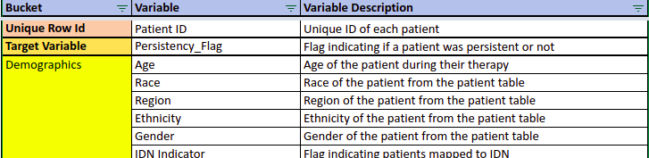
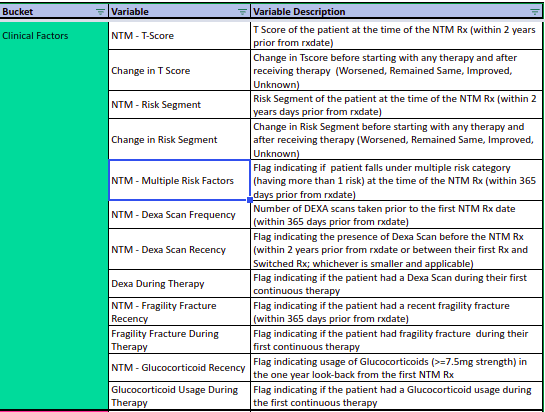
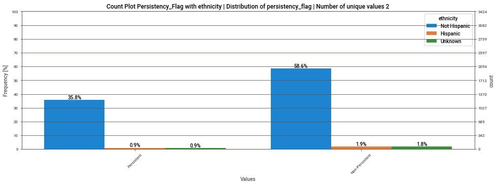
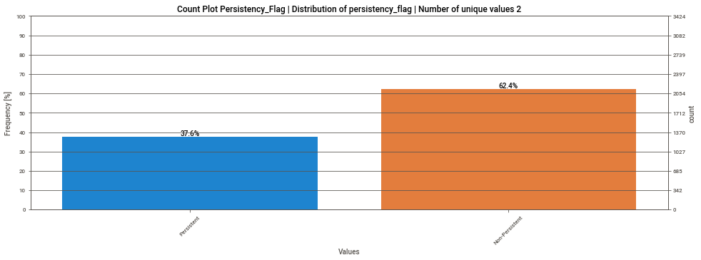
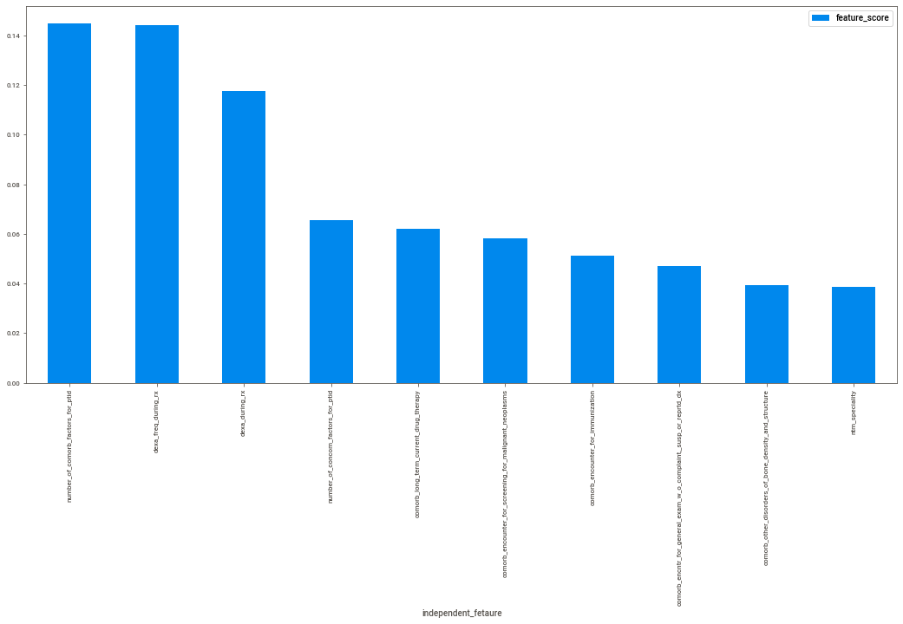
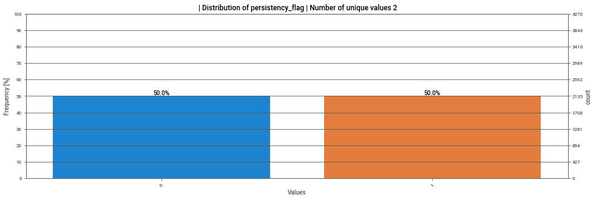
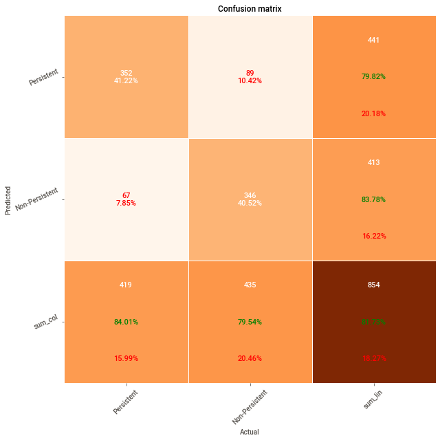
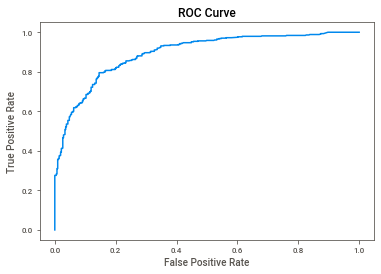

## Drug Persistency Classification

### Problem Statement
Pharmaceutical companies face challenges in understanding the persistency of drug usage as prescribed by physicians. This project aims to gain insights into the factors influencing persistency and to build a classification model based on the provided dataset.

- **Target Variable**: `Persistency_Flag`

### Project Overview
The project involves a comprehensive analysis of pharmaceutical data to determine factors that impact drug persistency. The project includes data preprocessing, exploratory data analysis (EDA), feature engineering, model building, and evaluation to classify and predict drug persistency.

### Approach Summary

#### 1. Understanding and Initial Data Exploration
   - Reviewed the dataset and catalog to understand variable meanings and use cases.



   - Developed utility functions for basic analysis and visualization.
#### 2. Data Cleaning and Preparation
   - **Duplicate Check**: No duplicate records found.
   - **Missing Value Check**: No missing values were present.
   - **Outlier Analysis**: Identified potential outliers in `dexa_freq`, where an average of 3 scans in 365 days contrasts with a maximum of 146 scans.
   - **Feature Observations**:
     - **Numeric**: For `dexa_freq`, reviewed outliers; `count_of_risks` showed a near-normal distribution.
     - **Categorical**: Many features (e.g., `ethnicity`) displayed skewed distributions that could impact model influence. Dropped skewed features accordingly.
      

   - **Imbalance Handling**: Addressed slight class imbalance.
    
    

#### 3. Feature Engineering and Transformation
   - **Encoding**: Applied one-hot and label encoding for categorical features.
   - **Scaling**: Scaled numerical features.
   - **Feature Selection**: Used `SelectKBest` to select the most impactful features for modeling.
    
   - **Data Balancing**: Employed SMOTE for oversampling to handle class imbalance.
    
    
   
#### 4. Modeling and Evaluation
   - **Models Applied**:
     - Logistic Regression
     - Decision Tree
     - Random Forest (performed best among the models)
   - **Hyperparameter Tuning**: Optimized hyperparameters for the Random Forest model.
    
    


#### 5. Performance Metrics for Random Forest
   - **F1 Score**: 0.809
   - **AUC**: 0.894

### Installation and Setup

1. **Clone the repository**:
   ```bash
   git clone https://github.com/Abhishek53/data-science.git
   cd case_studies/drug_pesistancy_check
   ```

2. **Environment Setup**:
   - Set up and activate a virtual environment (optional).
   - Install dependencies:
     ```bash
     pip install -r requirements.txt
     ```

### Usage
To execute the notebook:

### Model Diagnostics and Results
The `Analysis Results` Excel file includes model diagnostics, hyperparameters, and evaluation metrics.

### Contributing
Contributions are welcome! Please ensure your code follows the project guidelines.
