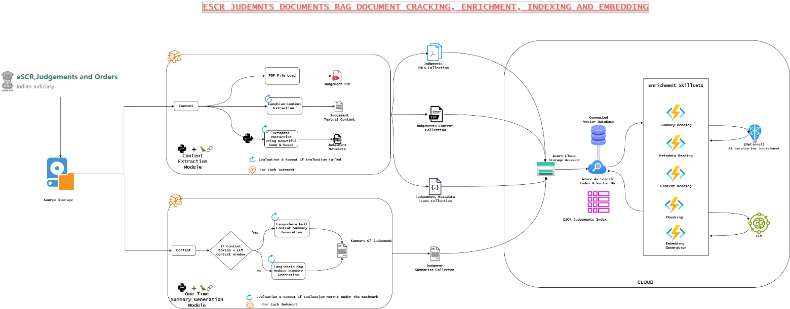

Here’s a structured README file draft based on your project details:

---

## AI-Based Legal Chatbot for Case-Related Information

### Problem Statement
The project aims to develop an AI-driven conversational chatbot capable of responding to case-related queries in English and the 22 scheduled languages of the Constitution of India, 1950. The chatbot provides insights into case information, judgment summaries, court documents, and other legal information.
  
### Background and Research
The Eighth Schedule of the Indian Constitution mandates support for the following 22 languages: Assamese, Bengali, Gujarati, Hindi, Kannada, Kashmiri, Konkani, Maithili, Malayalam, Manipuri, Marathi, Nepali, Oriya, Punjabi, Sanskrit, Santali, Sindhi, Tamil, Telugu, Urdu, Bodo, and Dogri. The chatbot leverages public datasets from the Supreme Court of India, including judgments digitized under the **Electronic Supreme Court Reports (e-SCR) project**, led by the Chief Justice of India, Dr. Justice Dhananjaya Y Chandrachud, launched on 2nd January 2023.

- **Dataset Information**: eSCR contains 36,803 Supreme Court judgments and 14,494,999 High Court judgments. For this POC, judgments from January to August 2024, involving the Chief Justice of India, form the primary dataset.

### Technology and Services Utilized
The Supreme Court of India’s various IT services, including **e-Courts Services Portal, live court transcriptions, and the National Judicial Data Grid**, are integrated for enhanced access to legal data, supporting deep connections to the judicial system.

### Data Collection Flow
The project leverages an indexing pipeline to organize and prepare eSCR judgments for AI-based retrieval. The backend workflow, designed to index judgments effectively, enables seamless question-answering capabilities in the chatbot.

### POC Architecture
The solution architecture consists of multiple modules designed for preprocessing, data enrichment, retrieval, and response generation:


1. **Data Preparation**:
   - Multiple preprocessing steps are employed to clean, organize, and enhance legal document datasets.
   - Advanced summarization techniques, including map-reduce, extract summaries from the documents, ensuring critical information is accessible and concise.

2. **Data Enrichment and Indexing**:
   - Enriched legal documents are indexed in a structured database, allowing for efficient querying and retrieval.
   
3. **Question Processing and Retrieval**:
   - User queries are analyzed for language and content, translating non-English questions to English as needed.
   - Embedding generation and a hybrid search approach (semantic and vector-based) enable relevant document retrieval. A re-ranking fusion algorithm ensures top-quality responses based on factual evidence.
   - For responses in regional languages, English results are translated back into the user’s requested language.

### Key Features
- **Q&A in Regional Languages**: Support for generating responses in scheduled languages.
- **Cross-Language Q&A**: Cross-linguistic interaction, such as asking questions in English and receiving answers in regional languages.
- **Summary Generation**: Summarization capabilities in both English and regional languages.

### Installation
To set up the project locally:

```bash
# Clone the repository
git clone https://github.com/username/project-name.git

# Navigate to the project directory
cd project-name

# Install dependencies
pip install -r requirements.txt
```

### Usage
```bash
# Run the main chatbot application
python main.py
```

### Contributing
Contributions are welcome. Please adhere to the project’s code of conduct and submit pull requests for review.

### License
[Specify License Here]

---

Let me know if you need any additional details or sections!